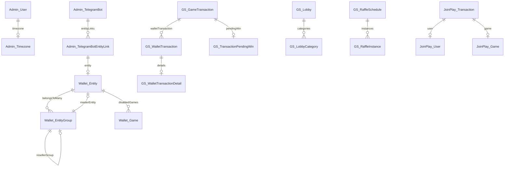

# Models Reference

**Total Models:** 86 across 6 domains

## Admin Domain (9 models)

### Admin_User
**Table:** `users` | **Connection:** `admin-master` | **File:** `app/Models/Admin/Admin_User.php`

| Column | Type | Cast | Notes |
|--------|------|------|-------|
| id | int | - | PK |
| name | string | - | - |
| email | string | - | Unique |
| password | string | hidden | - |
| timezone_id | int | - | FK → timezones |
| enabled | bool | - | - |
| god_mode_enabled | bool | - | Hardcoded for IDs 1,2,7,10,11 |
| gameprovider_proxy_manipulation | bool | - | - |
| advanced_functionality_enabled | bool | - | - |

**Relationships:**
| Method | Type | Related Model | FK |
|--------|------|---------------|-----|
| `timezone()` | belongsTo | Admin_Timezone | timezone_id |

**Key Methods:**
- `isGodModeEnabled(): bool` - Check god mode status
- `isGameproviderProxyManipulationEnabled(): int` - Check proxy manipulation permission
- `isAdvanced(): bool` - Check advanced functionality flag
- `getHardcodedGodModeUserIds(): array` - Returns [1, 2, 7, 10, 11]

### Admin_Environment
**Table:** `environments` | **Connection:** `admin-master`

**Relationships:**
| Method | Type | Related Model |
|--------|------|---------------|
| `databaseConnections()` | hasMany | Admin_EnvironmentDatabaseConnection |

### Admin_AuditLog
**Table:** `audit_log` | **Connection:** `admin-master`

**Relationships:**
| Method | Type | Related Model |
|--------|------|---------------|
| `user()` | belongsTo | Admin_User |

### Admin_TelegramBot
**Table:** `telegram_bots` | **Connection:** `admin-master`

**Casts:** `settings → array`

**Relationships:**
| Method | Type | Related Model |
|--------|------|---------------|
| `entityLinks()` | hasMany | Admin_TelegramBotEntityLink |

### Admin_TelegramBotEntityLink
**Table:** `telegram_bots_entities` | **Connection:** `admin-master`

**Relationships:**
| Method | Type | Related Model |
|--------|------|---------------|
| `telegramBot()` | belongsTo | Admin_TelegramBot |
| `entity()` | belongsTo | Wallet_Entity |

### Other Admin Models
- **Admin_EnvironmentDatabaseConnection** - `environments_database_connections`
- **Admin_IpAddress** - `ip_addresses`
- **Admin_RsyslogSystemEvents** - `rsyslog_system_events`
- **Admin_Timezone** - `timezones`

---

## Wallet Domain (22 models)

### Wallet_Entity
**Table:** `entities` | **Connection:** `wallet-master` | **File:** `app/Models/Wallet/Wallet_Entity.php`

**Casts:**
| Field | Cast |
|-------|------|
| id | int |
| ggr_usage_limit | decimal:2 |
| current_ggr | decimal:2 |
| available_balance | decimal:2 |
| used_balance | decimal:2 |
| config | collection |

**Relationships:**
| Method | Type | Related Model | Pivot/FK |
|--------|------|---------------|----------|
| `entityGroups()` | belongsToMany | Wallet_EntityGroup | entities_xref_entities_groups |
| `entityGroupsWhereMaster()` | hasMany | Wallet_EntityGroup | master_entity_id |
| `disabledGames()` | belongsToMany | Wallet_Game | entities_xref_disabled_games |

**Key Methods:**
- `getMasterEntity(): Wallet_Entity`
- `isMasterEntity(): bool`
- `isGroupMasterEntity(): bool`
- `isUsageLimitExceeded(): bool`
- `getLimitPercentage(): ?float`
- `getUnusedBalance($currency=null): ?float`
- `getAvailableBalance($currency=null): ?float`
- `hasBalanceLimitApiAccess(): bool|string`
- `hasCampaignsApiAccess(): bool`
- `canDisableGames(): bool`

### Wallet_EntityGroup
**Table:** `entities_groups` | **Connection:** `wallet-master`

**Relationships:**
| Method | Type | Related Model | Notes |
|--------|------|---------------|-------|
| `entities()` | belongsToMany | Wallet_Entity | - |
| `masterEntity()` | belongsTo | Wallet_Entity | master_entity_id |
| `resellerGroup()` | belongsTo | Wallet_EntityGroup | Self-referencing |
| `resellerManagedGroups()` | hasMany | Wallet_EntityGroup | Self-referencing |

**Key Methods:**
- `isReseller(): bool`
- `addGroupsToResellerGroup(array): void`
- `removeGroupsFromResellerGroup(array): void`

### Wallet_Game
**Table:** `games` | **Connection:** `wallet-master` | **Incrementing:** false

**Casts:**
| Field | Cast |
|-------|------|
| details | json |
| config | json |
| themes | array |
| features | array |
| jurisdiction_PE/BR/AR | bool |

**Relationships:**
| Method | Type | Related Model |
|--------|------|---------------|
| `disabledForEntities()` | belongsToMany | Wallet_Entity |

**Key Methods:**
- `getPossibleGameJurisdictions($withLabels=false): ?array`
- `getPossibleVolatilities(): array`
- `getPossibleTypes(): array`
- `getPossibleThemes(): array`
- `getPossibleFeatures(): array`
- `updateJurisdictions(Request): void`

### Wallet_Gameprovider
**Table:** `gameproviders` | **Connection:** `wallet-master`

**Casts:**
| Field | Cast |
|-------|------|
| in_maintenance_mode | bool |
| trust_custom_headers | bool |
| timeout_seconds | float |
| campaigns_api_enabled | bool |

**Key Methods:**
- `getVendorsAttribute($value): array` - Custom JSON decoding

### Wallet_GameproviderConfig
**Table:** `gameprovider_configs` | **Connection:** `wallet-slave`

**Relationships:**
| Method | Type | Related Model |
|--------|------|---------------|
| `gameprovider()` | belongsTo | Wallet_Gameprovider |
| `entity()` | belongsTo | Wallet_Entity |

### Wallet_GameProviderProxyOverride
**Table:** `gameprovider_proxy_overrides` | **Connection:** `wallet-master`

**Constants:** `TYPE_AMOUNT`, `TYPE_CURRENCY`, `TYPE_TRINITY`, `OPTION_RELAY`, `OPTION_HACK`

**Casts:** `properties → json`

**Relationships:**
| Method | Type | Related Model |
|--------|------|---------------|
| `games()` | hasMany | Wallet_GameProviderProxyOverrideGame |

### Other Wallet Models
- **Wallet_Currency** - `currencies` (PK: code string)
- **Wallet_Lobby** - `lobbies`
- **Wallet_VendorGroup** - `vendor_group`
- **Wallet_OperatorIntegration** - `operator_integrations`
- **Wallet_OperatorIntegrationConfig** - `operator_integration_configs`
- **Wallet_ConfigGroup** - `config_groups`
- **Wallet_EntityXrefEntityGroup** - `entities_xref_entities_groups` (pivot)
- **Wallet_GameProviderProxyGame** - `gameprovider_proxy_games`
- **Wallet_GameProviderProxyOverrideGame** - `gameprovider_proxy_overrides_games`
- **Wallet_GameProviderProxyServer** - `gameprovider_proxy_servers`
- **Wallet_GameProviderProxyApiServer** - `gameprovider_proxy_api_servers`
- **Wallet_GameProviderProxyDBReplica** - `gameprovider_proxy_db_replicas`
- **Wallet_GameProviderProxyRedisServer** - `gameprovider_proxy_redis_servers`
- **Wallet_WalletGameproviderDetails** - `wallets_gameproviders_details`
- **Wallet_EvoTrinityFailedTransaction** - `evolution_trinity_failed_transactions`
- **Wallet_GameproviderConfigCurrencyOverride** - `gameprovider_configs_currency_overrides`

---

## Gameserver Domain (41 models)

### GS_GameTransaction
**Table:** `game_transactions` | **Connection:** default

**Relationships:**
| Method | Type | Related Model |
|--------|------|---------------|
| `walletTransaction()` | hasMany | GS_WalletTransaction |
| `pendingWin()` | hasOne | GS_TransactionPendingWin |

### GS_WalletTransaction
**Table:** `wallet_transactions` | **Connection:** default

**Relationships:**
| Method | Type | Related Model |
|--------|------|---------------|
| `details()` | hasOne | GS_WalletTransactionDetail |

### GS_Lobby
**Table:** `lobbies` | **Connection:** default

**Casts:** `settings → array`

**Relationships:**
| Method | Type | Related Model |
|--------|------|---------------|
| `categories()` | hasMany | GS_LobbyCategory |

### GS_LobbyCategory
**Table:** `lobby_categories` | **Connection:** default

**Relationships:**
| Method | Type | Related Model |
|--------|------|---------------|
| `games()` | hasManyThrough | GS_Game |

### GS_RaffleSchedule
**Table:** `raffle_schedules` | **Connection:** `gameserver-master`

**Casts:** `settings → array`

**Relationships:**
| Method | Type | Related Model |
|--------|------|---------------|
| `instances()` | hasMany | GS_RaffleInstance |

### Other Gameserver Models
| Model | Table | Notable |
|-------|-------|---------|
| GS_User | players | - |
| GS_Session | session | - |
| GS_Game | game | - |
| GS_Round | rounds | - |
| GS_TransactionPendingWin | transaction_pending_win | PK: game_transaction_id |
| GS_WalletTransactionDetail | wallet_transaction_details | PK: wallet_transaction_id |
| GS_WalletEntity | wallet_entities | config → array |
| GS_GameType | game_type | Constants for game types |
| GS_GameLimit | game_limit | - |
| GS_GamePayout | game_payout | - |
| GS_GamePayTable | game_pay_table | - |
| GS_GameSlotPair | game_slot_pair | PK: slot_pair_id |
| GS_GameReelSet | game_reel_set | - |
| GS_GameSimulation | game_simulation | details/bets → array |
| GS_Queue | queue | Connection: gameserver-master |
| GS_QueueFailed | queue_failed | Connection: gameserver-master |
| GS_ChatChannel | chat_channels | - |
| GS_ChatMessage | chat_messages | - |
| GS_ErrorLog | error_log | - |
| GS_ConfigGroup | config_groups | - |
| GS_RaffleTicket | raffle_tickets | - |
| GS_RaffleInstance | raffle_instances | settings/state → array |
| GS_Schedule | schedules | - |
| GS_ScheduleLog | schedule_logs | - |
| GS_UserFreespin | player_freespins | - |
| GS_MultiplayerGameRoom | multiplayer_game_rooms | settings → array |
| GS_MultiplayerGameRoomRoutes | multiplayer_game_room_routes | - |
| GS_MultiplayerGameRound | multiplayer_game_rounds | - |
| GS_MultiplayerServerLog | multiplayer_server_log | details → array |
| GS_EmiratesDrawCart | emiratesdraw_carts | numbers → array |
| GS_EmiratesDrawDrawing | emiratesdraw_drawings | payouts → array |
| GS_EmiratesDrawFavourite | emiratesdraw_favourites | numbers → array |
| GS_EmiratesDrawLimit | emiratesdraw_wallet_entity_balances | - |
| GS_EmiratesDrawTicket | emiratesdraw_tickets | numbers → array |
| GS_EmiratesDrawDomainSeal | domain_seals | Connection: emiratesdraw-validator-master |

---

## Backoffice Domain (4 models)

### Backoffice_User
**Table:** `users` | **Connection:** `backoffice-slave`

**Relationships:**
| Method | Type | Related Model |
|--------|------|---------------|
| `timezone()` | belongsTo | Backoffice_Timezone |

**Key Methods:**
- `getLoginDomainOptions(): array`
- `getAllPossiblePermissions(): array`
- `getNewUserPermissions(): array`
- `getResellerGroup(): ?Wallet_EntityGroup`

### Other Backoffice Models
- **Backoffice_Permission** - `permissions`
- **Backoffice_BalanceLimitHistory** - `balance_limit_history`
- **Backoffice_Timezone** - `timezones`

---

## DataAggregation Domain (4 models)

### DataAggregation_CurrencyExchangeRate
**Table:** `currency_exchange_rates` | **Connection:** `data-aggregation-slave`

**Key Methods:**
- `convertAmountFromEuro($amount, $toCurrencyCode, $decimals): ?float`
- `convertAmount($amount, $fromCurrencyCode, $toCurrencyCode, $decimals): ?float`

### DataAggregation_KpiPerEntity
**Table:** `kpi_per_entity` | **Connection:** `data-aggregation-slave`

**Casts:** `is_dirty → bool`

### Other DataAggregation Models
- **DataAggregation_LimitsPerEntity** - `limits_per_entity`
- **DataAggregation_LotteryTicketPurchases** - `lottery_ticket_purchases`

---

## JoinPlay Domain (6 models)

### JoinPlay_Transaction
**Table:** `transactions` | **Connection:** `joinplay-slave`

**Relationships:**
| Method | Type | Related Model |
|--------|------|---------------|
| `user()` | belongsTo | JoinPlay_User |
| `game()` | belongsTo | JoinPlay_Game |

### JoinPlay_Token
**Table:** `tokens` | **Connection:** `joinplay-slave`

**Relationships:**
| Method | Type | Related Model |
|--------|------|---------------|
| `user()` | belongsTo | JoinPlay_User |

### JoinPlay_Operator
**Table:** `operators` | **Connection:** `joinplay-slave`

**Casts:** `config → array`

### JoinPlay_UserHttpAuth
**Table:** `users_http_auth` | **Connection:** `joinplay-slave` | **PK:** username (string)

**Casts:** `restrictions → array`

**Key Methods:**
- `getOperator(): ?JoinPlay_Operator`

### Other JoinPlay Models
- **JoinPlay_User** - `users`
- **JoinPlay_Game** - `games`

---

## Entity Relationship Diagram

